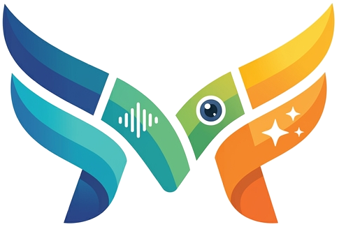

<p align="center"></p>

# Muta7

Accessibility impairment simulation extension

Muta7 is a Chromium browser extension that simulates real-world accessibility impairments so you can experience UX friction directly—beyond static audits. Perfect for developers, designers, and anyone who wants to understand how people with disabilities navigate the web.

## Features

- **Visual Impairment Simulation** (v0)
  - Adjustable blur intensity
  - Color blindness filters (Protanopia, Deuteranopia, Tritanopia, Monochromacy)
- **Website Scoping**
  - Enable only on specified websites
  - Support for origin and path-level rules
- **Developer-Friendly UI**
  - Instant toggle and intensity controls
  - Visual reminder when simulations are active
  - Extension badge shows active count
- **Privacy-First**
  - No analytics, no accounts, no backend
  - All state stored locally
  - Your data never leaves your browser
  - No tracking or user monitoring

## Installation

### From Source (Development)

1. Clone this repository
```bash
git clone https://github.com/Fcmam5/muta7.git
cd muta7
```

2. Load in Chromium
- Open `chrome://extensions`
- Enable "Developer mode"
- Click "Load unpacked"
- Select the `muta7` directory

### From Chrome Web Store (Coming Soon)

*Will be available once published.*

## Usage

### Quick Start

1. Open any website
2. Click the Muta7 extension icon
3. Click "Enable for current website" or add URL rules
4. Toggle "Blur simulation" and adjust intensity
5. Refresh if prompted after changing website scope

### Website Scoping

By default, Muta7 works only on websites you specify:

- **Enable for current website** — Adds the current site origin
- **Enable for URLs** — Add multiple rules (one per line)
  - Supports bare domains: `example.com`
  - Supports full URLs: `https://example.com/app`
  - Origin rules match entire site
  - Path rules match that path and deeper

### Controls

- **Blur simulation** — Toggle on/off
- **Intensity** — Slider from 0–100
- **Color blindness filter** — Toggle on/off with selectable modes
- **Reminder banner** — Shows when any simulation is active
- **Extension badge** — Shows active simulation count

## What This Is Not

**Muta7 is not an accessibility reporting or checklist tool.**

For comprehensive accessibility testing and compliance, use dedicated tools maintained by experts:
- [Lighthouse](https://developer.chrome.com/docs/lighthouse/overview)
- [Axe](https://www.deque.com/axe/)
- [W3C Web Accessibility Evaluation Tools List](https://www.w3.org/WAI/test-evaluate/tools/list/)

Muta7 complements these tools by letting you *feel* accessibility issues, not just detect them.

## Development

### Prerequisites

- Chromium-based browser (Chrome, Edge, Brave, etc.)
- No external dependencies required

### Project Structure

```
muta7/
├── src/
│   ├── background/          # Service worker
│   │   └── service-worker.js
│   ├── content/             # Content scripts
│   │   └── index.js
│   ├── modules/            # Simulation modules
│   │   └── visual/
│   │       └── blur.js
│   └── popup/              # Extension popup
│       ├── popup.html
│       ├── popup.css
│       └── popup.js
├── manifest.json           # Manifest V3
└── README.md
```

### Adding a New Simulation Module

1. Create module file in `src/modules/[category]/[name].js`
2. Expose `enable(config)`, `disable()`, `update(config)`
3. Load in `manifest.json` content_scripts
4. Add UI controls in popup
5. Wire state in background service worker

### Code Style

- Use modern JavaScript (ES modules)
- Keep modules independent and reversible
- Prefer CSS filters for visual effects
- Separate UI, state, and DOM logic

## Contributing

We welcome contributions! Please see [CONTRIBUTING.md](CONTRIBUTING.md) for guidelines and [CODE_OF_CONDUCT.md](CODE_OF_CONDUCT.md) for our community standards.

## Privacy

**Muta7 does not and will not store your data.**

- **No Analytics Tools** - I don't use any analytics or tracking tools (except if something is provided by Chrome Web Store for distribution metrics)
- **No User Data Collection** - I won't know who's using the extension or how/where it's being used
- **Local Storage Only** - All extension settings and state are stored locally in your browser
- **No Backend Servers** - This extension operates entirely offline without any external services

### Get in Touch

Since I can't track usage or know who you are, please reach out to me directly:
- **Twitter**: [@Fcmam5](https://twitter.com/Fcmam5)
- **GitHub**: Issues and discussions here on this repository

Your feedback helps improve the extension for everyone!

## Security

If you discover a security vulnerability, please see [SECURITY.md](SECURITY.md) for reporting instructions.

## AI Usage

This project was bootstrapped with AI assistance, including the initial codebase and logo. Contributors using AI must follow our [AI usage guidelines](CODE_OF_CONDUCT.md#ai-usage-policy) and review all code before submission.

## License

This project is licensed under the MIT License - see [LICENSE](LICENSE) for details.

## Acknowledgments

- Inspired by the need for experiential accessibility testing
- Built with Manifest V3 for modern browser extension standards
- Community feedback and contributions

---

**Muta7** - Experience accessibility, don't just audit it.

## Support

If you find Muta7 helpful and want to support its development, you can:

- **Ko-fi**: [ko-fi.com/fcmam5](https://ko-fi.com/fcmam5)
- **Buy Me a Coffee**: [buymeacoffee.com/ngcmbf6](https://buymeacoffee.com/ngcmbf6)

Your support helps keep this extension free and maintained for everyone!
